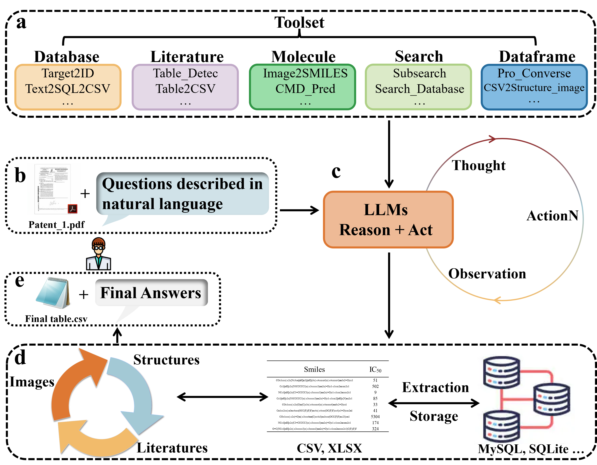

# ChatMolData

Implementation of the Paper "[ChatMolData: a Multimodal Agent for Automatic Molecular Data Processing](https://chemrxiv.org/engage/chemrxiv/article-details/67320b507be152b1d0bcf7f3)" (upload chemrxiv) by Yi Yu and xx. We assumed that the ChatMolData will bridge the gap between chemical experimenters and algorithm developers. 



## Install via Anaconda
Create a new envioronment:
```bash
cd chatmoldata
conda env create -f environment.yml
conda activate chatmoldata
```
Install the chatmoldata package
```bash
python setup.py install
```

## Getting start
First set up your API keys in your environment.
```
export OPENAI_API_KEY=your-openai-api-key
```

In a Python:
```python
from chatmoldata.agents import ChatMolData

CMD = ChatMolData(model="gpt-4", temp=0.1)
CMD.run('''Retrieve compound SMILES and IC50 for the target "CDK2", the IC50 < 1000nM.''') 
```
